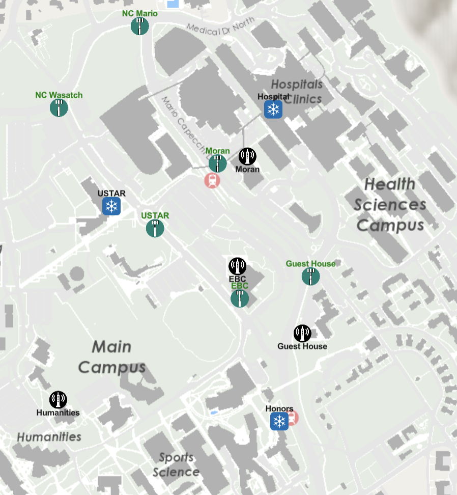

# Over-the-air (OTA) QPSK Project

## Specifications

- normalized symbol rate: 1/8 symbol/sample
- complex baseband sampled signal
- carrier phase offset: unknown
- additive noise: this is over-the-air, so thermal noise and interference (at a very low level) are present at the receiver
- pulse shape: Square root raised cosine (SRRC), roll-off = 50%, Lp = 6 symbols.
- average energy per symbol: unknown
- input file: `test_2-06-2024_cbrssdr1-hospital-comp_to_cbrssdr1-honors-comp.mat`
- input message length: 329 data symbols (658 bits)
- There is a header before the data symbols start:
- Preamble: The first 32 symbols, correspond to the bits [1, 1, 0, 0] repeated 16 times.
- Sync word: The next 8 symbols correspond to the bits [1, 1, 1, 0, 1, 0, 1, 1, 1, 0, 0, 1, 0, 0, 0, 0].
- time synchronization: unknown
- frequency synchronization: perfect
- carrier frequency: 3.398 GHz
- Locations: transmitter is on the roof of the University of Utah Hospital, receiver is on the roof of the Honors Residence Building, both in Salt Lake City, Utah, part of the POWDER wireless testbed. Map below. The two buildings "Hospital" and "Honors" are about 700 m apart.

## Design the Detector

Design the QPSK detector shown above. Notes here on each block.

### Load the data

The data is in the .mat file linked above. The complex-valued received signal is in the array "s".

### Pulse Shape Filter
Filter with the pulse shape, as described above.

### Gain

The signal arrives with a pretty low amplitude (even though the SNR is pretty high). The gain stage is primarily to make the values easier to look at. You can normalize by the mean of the abs() of the samples, for example. This is not necessary, and you can chose how (and whether or not) to do this.

### Header Symbol Values

In this section, you need to build part of the transmitter for the header bits. Take the header described above (40 symbols, or 80 bits). Generate a symbol value for each symbol. The value of the QPSK radius you use is arbitrary. The upsample by N block is self explanatory. You should have `40*N` samples, I call this vector `h`.

### Cross-Correlation Block

You will compute the cross-correlation of `h` and the output of the gain block. I used Matlab's `[c, lags] = xcorr(y, h)`  function, where `y` is the output of my gain block. (You can use filter, but you need to flip `h` and take its complex conjugate, which I find counterintuitive.) Then find the maximum of the cross-correlation:

`[value, ind] = max(abs(c))`

In python, the scipy.signal package has two functions, `correlate()` and `correlation_lags()`, apparently you need to call them separately to get the two outputs `c` and `lags` described above.

Finally, find the index in `y` where the maximum correlation occurs, `startSample = lags(ind)+1`. (You don't need the +1 in python.) The `lags(ind)`` gives you an integer delay between the two, i.e., a measure of the time delay. The plus one is because matlab indices start at 1, not 0. If `startSample` is negative, you likely have the order of the arguments to `xcorr()` incorrect.

Turn in a plot of the absolute value of the cross-correlation, identifying the lag of the maximum value on the plot.

### Phase Synch

The phase angle of the cross-correlation value at the maximum, `angle(c(ind))`, is the same phase offset that needs to be removed. Because we used the entire header to do the cross-correlation, xcorr essentially tells us how far off in angle the received signal is compared to the header signal `h` we generated. Remove this angle theta by multiplying all samples of y by `exp(-1j*theta)`.

### Time Sync and Downsample

You want to start looking at the data symbols after the header, which is 40 long.

`dataStartInd = startSample + 40*N`

We drop all of the samples before dataStartInd, in matlab, use the range (dataStartInd:end).

At this point, plot two eye diagrams, one for the real part of the signal, and one for the imaginary part of the signal.

Then, downsample the signal, start N samples after that, and then take one symbol value every N samples. In matlab, use this indexing for the sync and the downsampling.

`N:N:end`

Also remember that you only need 329 data symbols. After that, its just noise.

Plot the signal space projection plot with `r` to turn in.

### Symbol Decision and Message Extraction

Make symbol decisions given the known constellation, convert to bits (you should have `2*329`), and then to a 94-length character string. Turn in the output message.

### To Turn In:
Plots to turn in (each described above):
1. absolute value of the cross-correlation, and lag of the max
2. the two eye diagrams, one for the in-phase and one for the quadrature.
3. the signal space projections, which is a single plot, as before.
4. Text to turn in: The 94-length message.

Attach a PDF containing the Matlab code and the above plots and message. Note that you may feel free to modify functions I have distributed; but then include your modified versions with your submission.